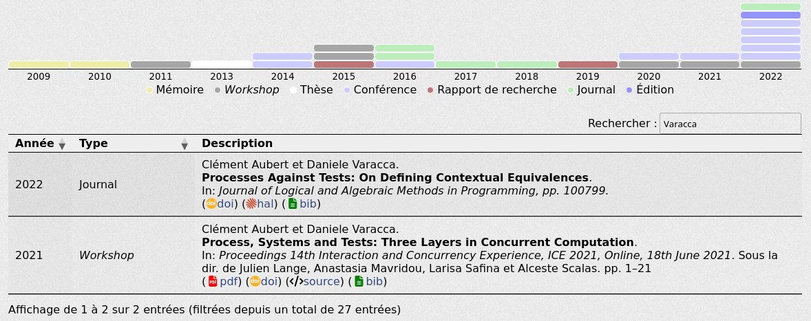

# Presentation

bib-publication-list is a javascript tool to automatically generate an interactive HTML publication list from a BibTeX file.
It uses [jQuery](http://jquery.com/), [DataTables](http://datatables.net/), and [JavaScript BibTeX Parser](http://sourceforge.net/projects/jsbibtex/).

## Demo

There are example files in the [`test/html`](test/html/) folder, please refer to them for examples and live demos.
Alternatively, you can see this plug-in live [on my French website](https://aubert.perso.math.cnrs.fr/#publicatio) or [on the English one](https://spots.augusta.edu/caubert/#bib-publication-list).

## Getting Started

To use this program, you will need to 

- Include your [BibTex](https://www.bibtex.com/) references in your `html` webpage,
- Load one css file and two javascript libraries (jQuery, and our script),
- Call the program with a `<script>` element.

The pre-compiled (and minified) files are at [in the release](https://github.com/aubertc/bib-publication-list/releases).

### Include your BibTex

Include the BibTeX into an HTML page and the `<div>` element where you want your list of references to appear.

For example:

```html
<div id="bib-publication-list">
    <table></table>
</div>
<pre id="bibtex">
@inproceedings{Aubert2022FSCD,
    editor = {Felty, Amy P.},
    doi = {10.4230/LIPIcs.FSCD.2022.26},
    pages = {26:1--26:23},
    volume = {228},
    series = {LIPIcs},
    publisher = {Schloss Dagstuhl - Leibniz-Zentrum f{\"{u}}r Informatik},
    booktitle = {FSCD 2022},
    year = {2022},
    author = {Aubert, Clément and Rubiano, Thomas and Rusch, Neea and Seiller, Thomas},
    title = {mwp-Analysis Improvement and Implementation: Realizing Implicit Computational Complexity},
}
</pre>
```

The graph and the legend will be inserted just above the table. If you want to place them anywhere else in
the page, e.g. if you want to wrap your table in a container and have the graph and legend outside, you
can declare them in the HTML. The script won't insert new elements before the table and will instead use
the ones you have created.

```html
<div id="bib-publication-list">
    <div class="bibchart-container">
        <div class="bibchart"></div>
    </div>
    <div class="legend"></div>
    <div class="some-table-wrapper">
        <table></table>
    </div>
</div>
```

### Loading the library

Load the css file, [jquery](https://releases.jquery.com/) and our script: 

```html
<link rel="stylesheet" href="bib-list.css">
...
<script
            src="https://code.jquery.com/jquery-3.6.1.js"
            integrity="sha256-3zlB5s2uwoUzrXK3BT7AX3FyvojsraNFxCc2vC/7pNI="
            crossorigin="anonymous"></script>
<script type="text/javascript" src="bib-list.js"></script>
```

Alternatively, you can use the compressed versions:
    
```html
<link rel="stylesheet" href="bib-list.min.css">
...
<script	  src="https://code.jquery.com/jquery-3.6.1.min.js"
            integrity="sha256-o88AwQnZB+VDvE9tvIXrMQaPlFFSUTR+nldQm1LuPXQ="
            crossorigin="anonymous"></script>
<script type="text/javascript" src="bib-list.min.js"></script>
```

### Call the script

Finally, the `bib-publication-list` needs to know the input data element and the output table (cf. [below](#configuration-options) for the configuration options).
So, some JavaScript:

```html
<script type="text/javascript">
    $(document).ready(function() {
    bibtexify("#bibtex", "bib-publication-list");
    });
</script>
```

And _voilà_!




### Icon support

Optionally, you can add the [Academicons](https://jpswalsh.github.io/academicons/) and [fontawesome](https://github.com/FortAwesome/Font-Awesome) stylesheets, using

```html
<link rel="stylesheet" href="https://cdnjs.cloudflare.com/ajax/libs/font-awesome/6.2.1/css/all.min.css">
<link rel="stylesheet" href="https://cdn.jsdelivr.net/gh/jpswalsh/academicons@1/css/academicons.min.css">
```

to obtain the icons as pictured above. This is optional.

## Configuration Options

When calling `bibtexify`, two options are mandatory:

- the `id` of the `pre` element containing the bibliography,
- the `id` of the `div` element containing the table that will display the references.

The bibtexify function also accepts an optional third parameter for configuration options. These options include:

option | arguments
--- | ------------
lang | Language to use. Now support `en` (English, default) and `fr` (Français).
visualization | A boolean to control addition of the visualization. Defaults to `true`.
sorting | Control the default sorting of the list. Defaults to `[[0, "desc"], [1, "desc"]]`. See <https://datatables.net/reference/api/#fnSort> for details on formatting.
datatable | Pass options to the datatable library used to create the table of publications. See <https://datatables.net/reference/api/> for available options.
defaultYear | Entries without a year will use this as year. Defaults to "To Appear" if `lang` is `en` (default), "À paraître" if `lang` is `fr`.

An example of such usage would be:

```js
bibtexify("#bibtex", "bib-publication-list", {'defaultYear': '2001', 'lang': 'fr'});
```

## Building from source

There is a [Makefile](Makefile) for building with make.
The minified version requires [minifier](https://www.minifier.org/).
On debian, a simple

```
sudo apt-get install -y minify
```

will take care of this dependency. Maybe [this version](https://github.com/tdewolff/minify/tree/master/cmd/minify) would work as well, but it hasn't been tested.

# Alternatives

I list here some approaches that, essentially, "convert `bib` files plus some input into `html`", either dynamically or statically.

## Dynamyc 

### BibBase

The [BibBase](https://bibbase.org/) tool seems to offer interesting options, but [it is a commercial solution](https://bibbase.org/network/pricing).

## Static

### Pandoc

[Pandoc](https://pandoc.org/) can be used to [generate a html file from a BibTex file](https://tex.stackexchange.com/a/298385/34551), possibly [splitting it](https://github.com/jgm/citeproc/issues/5) (cf. also [this issue](https://github.com/jgm/pandoc-citeproc/issues/89)) using [a lua filter](https://github.com/pandoc/lua-filters/tree/master/multiple-bibliographies).

### htmbib 

The [htmlbib project](https://github.com/astahfrom/htmlbib) project can be tested [directly on-line](https://astahfrom.github.io/htmlbib/).


# Credits

This code uses some great libraries: [jQuery](http://jquery.com/), [DataTables](http://datatables.net/),
and [JavaScript BibTeX Parser](http://sourceforge.net/projects/jsbibtex/)[^1].

[^1]: This latter library could probably [be replaced](https://github.com/aubertc/bib-publication-list/issues/1) by [bibtexParseJS ](https://github.com/ORCID/bibtexParseJs) with benefits.

# History / Changelog and Licences

This is a fork of [bib-publication-list](https://github.com/GioBonvi/bib-publication-list), which is itself a fork of [bib-publication-list](https://github.com/vkaravir/bib-publication-list) that I created for personal use.

The main changes are:

- [Updated](https://github.com/aubertc/bib-publication-list/commit/96fed3ad87cec534ca327c55a44a176fbb1c5e93) [DataTables](https://datatables.net/) to 1.13.1,
- [Added support](https://github.com/aubertc/bib-publication-list/commit/4155d66a05e741443b545f0b207a51d970372d0c) for `doi` and `eprint` fields.
- [Added support](https://github.com/aubertc/bib-publication-list/commit/36840c0a564d395da57890a914e051da873c7e4a) for [Academicons](https://jpswalsh.github.io/academicons/) and [fontawesome](https://github.com/FortAwesome/Font-Awesome)[^2].
- Changed some styles,
- Improved example files,
- Added support for French in addition to English,
- Generally clarifying the documentation.

[^2]: To use it, remember to include the fonts, using `	<link rel="stylesheet" href="https://cdnjs.cloudflare.com/ajax/libs/font-awesome/4.7.0/css/font-awesome.min.css"><link rel="stylesheet" href="https://cdn.jsdelivr.net/gh/jpswalsh/academicons@1/css/academicons.min.css">`, as presented in some of [the examples](test/html).

The [previous fork](https://github.com/GioBonvi/bib-publication-list) added the following:

- More flexible HTML structure
- Use of flexbox for a more responsive behavior
- Updated build tools
  - Removed deprecated code from old node versions
  - Switched JS minifier to uglify-js to improve minification
- Some minor changes in the CSS style
- Fixed some types of BibTex content requiring fields that are not actually required by BibTex standard
- Introduced the use of "et al." for publications with more than 6 authors

Unfortunately, the licence under which this code was originally written is unknown, and the authors [have not responded to my request](https://github.com/vkaravir/bib-publication-list/issues/29), so I am unable to place this code under any licence. If it was up to me, I'd use the [WTFPL](http://www.wtfpl.net/about/), and all my commits can be considered under that licence (that allows you to re-use my code with a different licence if you wish to do so).

## Deprecated 

It used to be the case that the bibtex could be loaded from a file.
This feature seems to be broken now (and to have been [unreliable in the past](https://github.com/vkaravir/bib-publication-list/issues/11)) but here is what the [original author wrote](https://github.com/vkaravir/bib-publication-list#getting-started):

> Personally I prefer including it in the HTML,
> though. This way, browsers without JavaScript enabled get at least to see the bibtex instead of a blank page.
> This causes an ugly-looking flash of unstyled content, though.
>
>    bibtexify("example-biblist.bib", "bib-publication-list");
>
>
>If you want to fix the flash of unstyled content, you can hide the #bibtex element and make it
visible when JavaScript is disabled. To do that, add
>
>    #bibtex { display: none; }
>
> to your CSS and
> 
>     <noscript><style>#bibtex { display: block; }</style></noscript>
> 
> to your HTML.

The possibility of adding links to tweeter accounts was also deprecated, and was removed.
